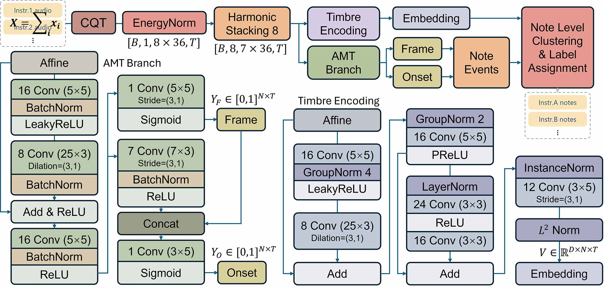

[English README](./README.md)

# [A Lightweight Architecture for Multi-instrument Transcription with Practical Optimizations](https://arxiv.org/abs/2509.12712)👈论文
目标是实现 轻量级的 音源分离 扒谱AI，其中音源分离不依赖训练集，而能对训练集之外的音色有普适性。

- **轻量级**：为了让研究切切实实落地应用。最终比baseline轻量了一半，成功部署到[notedigger](https://madderscientist.github.io/noteDigger/)中。其实如今已经有很多很优秀的分离扒谱商品了，而转换为token、用大模型的方法实现也有一统所有领域的趋势（特指MT3）。所以选择轻量也是避其锋芒的做法。但轻量也极大限制了能用的技术。
- **音源分离**：根据音色进行分离，称为“盲源分离”更确切，因为目标是不依赖训练集。和一般的“源分离”不同的是，本任务直接在“音符”的层面进行分离，而不是重构分离后的频谱。
- **扒谱**：学名“音乐转录”，结合“音源分离”指“扒带”，即输入为多音色音频，输出多轨音符，每一轨对应一种音色。

现有音色分离转录方法的缺点是没有泛化性，体现在两点上：

1. 严重依赖数据集，后果是不认识训练集之外的音色。相比于“分离”他们更像是“分类”，需要制定好要有哪些类别的音色，然后通过喂数据使模型“记住”各个音色。特点是精度很高，特别是针对某一种乐器的扒谱模型。但是适用性太窄了，除非到MT3这种大模型时才会有显著突破。
2. 分离能力受结构限制。语音分离领域的一个难点是“说话人数目未知”，而如果做“分类”，则一定要确定类别数。所以二分离的模型不能用于三分离，适用性受限。

本研究的目的就是解决如上两点，此外追求易用性——在浏览器中就可以使用。人类对音色的跟踪完全不是这样的，我们能区分出音色，而无需知道乐器叫什么，也就是说做的不是“音色的分类”而是“音色的区分”。以下是我的猜想：当我们听到某音色的音符后，我们先会和记忆中的音色比较，如果相近就归为一类，如果不同则认为是新的音色；而“记忆”里的音色，一部分是之前习得（类比训练集），更重要的是听这个音频前面部分时建立起来的记忆，相当于动态学习音色、动态归类。这个“动态性”就是实现研究目标的关键。

本研究将此任务拆解为两部分：

1. 先实现“音色无关转录”，即不根据音色分类，得到的是所有音色的音符。模型参考BasicPitch，并进行了改进。（幅度编码）
2. 再实现“音色分离转录”，基本思想是对音色进行聚类，给“音色无关转录”的音符分配标签。（方向编码）

本研究的贡献：

1. 轻量级音色无关转录模型（参数量、运行开销减半，性能与基线持平），训练参数量只有18978，但有不错的泛化性和精度。
2. 在音色无关转录基础上拓展出一个音色编码分支，能实现2-3个乐器的70%以上正确分离。
3. 针对“音乐转录”提出了专门的深度聚类后处理方法，在音符级进行聚类提高了鲁棒性、减少了计算量。
4. 优化了损失函数：修正了BasciPitch的加权策略；使用对比学习损失InfoNCE代替传统深度聚类相似度损失（对相似度矩阵求MSE），得到了更好的编码效果。

## 展望
虽然上文提到了“记忆”，但本研究其实并没有实现类似的机制。最初的构想是：让模型先学一遍输入的音频，得到“记忆”，再重新过一遍输入，从记忆中联想（查询）得到最终的结果。在“记忆”中，其实相似的音色就已经聚集在一起了。我尝试了Hopfield Network，并拓展到各种注意力机制，结果发现在音色编码网络不够强大的时候，记忆的引入反而会导致类别融合，即“记忆模糊”。理论上分析，Hopfield的最大记忆容量约为编码维度的0.14倍，如果要分离3种音色，编码维度需要达到22。对于浏览器中运行的模型，这个维度有点大了。所以我觉得模型规模增大时，该机制可能会有用。在 [./model/attention.py](./model/attention.py) 中留存了我们探索过的结构。具体的想法参看[./model/memory.md](./model/memory.md)。

本研究设计了一个合成数据的方法，但是效果远远不如真实数据集。论文中对其缺点进行了讨论，其中一个问题是：“缺少音域限制”，因为相邻音高的音色可以近似为不变，但是跨度大了确实有很大的不同。而可行的解决方法是：划分频带生成音符、限制生成范围。当然现在有很多模拟人工谱曲的算法，直接拿过来用可能效果会好很多。

虽然目标是“不依赖训练集”，但是为了学习到普适的编码，训练集还是越大越好。模型有泛化性不等于训练集很小。

本研究的两个分支相当于分别进行了幅度和方向的编码，而我认为直接编码一个特征，其方向表示音色、幅度表示强度，类似Hinton的Capsule，是一个有希望的方向。本项目的小网络不具备这样的编码能力（失败了），但我认为模型规模足够大时可以实现。

极力推荐《Harmonic Frequency-Separable Transformer for Instrument-Agnostic Music Transcription》，虽然没有分离音色，但是里面用到了很多我认为有希望（但是我没成功）的做法，比如：谐波卷积、attention与音色。

关于相位：音乐信号的相位作用不大（参考加法合成器）。由于本研究的任务不需要重构音频，所以可以直接抛弃相位。即使要重建音乐，我猜丢了相位也无关紧要。

## 文件夹结构
```
├─basicamt “音色无关转录”
├─basicpitch 作为“音色无关转录”的baseline，对比用
├─onsets_frames 作为“音色无关转录”的baseline，对比用
|
├─septimbre “音色分离转录”
├─Tanaka 作为“音色分离转录”的baseline，对比用
|
├─evaluate 模型评估的notebook
|
├─data 数据相关，如训练集、可视化
├─model 存放一些公用的torch.nn.Module
└─utils 存放一些公用的工具函数
```

## 使用
### 在线使用
本项目已经集成到 [noteDigger](https://madderscientist.github.io/noteDigger/) 中，可以便捷地进行人工后处理、或辅助人工扒谱。使用方法见下：


> 音色分离转录也已经部署（按钮“音色分离扒谱”），但是需要提供乐器种类。

### 开发
本项目已经将主要的训练结果导出为ONNX，只要配置好运行时就可以使用。模型的输入输出可以参看每个文件夹下的`use_model.ipynb`中导出为ONNX的部分。

### 训练
本项目使用 `uv` 管理环境，请先确保已经安装。然后在本项目根目录下，执行：

```
uv sync
```

随后就可以执行 `.ipynb` 了。第一步是准备数据，按照[data](./data/README.md)文件夹所说进行操作。

此外，项目依赖 `ffmpeg` ，需要可以直接通过命令行调用，需要额外安装。

> 注意：我们发现EPS对模型结果影响很大（取对数时越小的EPS效果越好），但是太小的EPS在导出为ONNX运行于浏览器时，似乎会被认为是0，导致NaN。因此我们最终选择1.01e-8。

## 碎碎念
这其实是我的毕业设计，自主选题。大学四年甚至高中的种种共同造就了这个课题。

初中时开始接触乐器和二次元，高一开始接触半音阶口琴（为了演奏二次元），但谱不够了，只能自己扒。靠耳朵显然不适合我这种新手，于是了解到wavetone，并被其扒谱方式深深折服——根据频域信息扒谱真是太方便了！于是做了个app：[哼歌扒谱](https://www.bilibili.com/video/BV18E411A7kC/)。不过当时不会对频域取对数，基频提取也用的是插件。基频提取显然远远不够，要实现wavetone的效果，我了解到了FFT，但是当时完全看不懂。

然后就高考了，扒谱是我择校的一半原因：冲着“信号”就认定了“电子信息”专业。另一半原因是觉得做硬件很酷，很想成为[Dimsmary](https://space.bilibili.com/5657589)这样的人，然后私信发现他是电子信息专业。高考是江苏前一千，最后被综评锁死到了SEU，身边人都很惋惜但其实我还挺满意：毕竟是电子信息强校。不出意外的，我接触到了很多硬件和信号处理知识，在大三的《数字信号处理》中终于学到了FFT，于是有了[noteDigger](https://madderscientist.github.io/noteDigger/)，算是达成一个目标。

不过我想学的知识、想掌握的技术已经在前5个学期中学完了。信息方向的下一步是通信，然而我对通信是一点不感兴趣。这才发现自己的目标虽然坚定但还是短浅。在大三下学期，以学院第四拿到了保研资格，难道要学通信了吗？或者选择信号处理方向？但我不想处理雷达信号，处理音频才合我意……这不就是AI干的事吗？于是决定跨保计算机。之前选修过AI方向的专业课，再补了点408相关知识，就开始陶瓷。

保研陶瓷本就费神，跨保更是鄙视链底端，不过最终还是以“智能科学与技术”专业保研了，脱离通信！导师是校外的，未来研究方向也不是通信，那毕设就没必要跟着老师走——做点自己喜欢的吧！于是就把这个课题推上去了。从24年9月就开始阅读论文，11月中旬正式确定为毕设选题，4月18日凌晨完成毕设论文（疑似全校第一），6月6日答辩。文献越读越简单，上手越做越难，前期屡屡碰壁，但从未后悔。虽然成果并不完美，但我还是挺骄傲的。

摘一段论文致谢吧：

    行文至此，总算了结了四年来的执念。说来好笑，这个课题的起因特别简单而纯粹——只是想演奏找不到谱子的动漫歌曲。没想到，对“谱”的执念一路指引着我走过了本科四年：为了学习信号处理，选择了东南大学电子信息；为了便于看谱，上线了一个谱库的微信小程序；为了制谱，写了一系列乐谱处理工具；为了便于扒谱，完成了一个平台；为了对图片简谱转调，初涉深度学习还小赚一笔；再到如今，竟已经能从学术角度研究扒谱并做出创新。虽然本项目的效果与我想要的还是相差甚远，但我仍然无比欣慰。

为什么谱对我这么重要？当初是特别喜欢某个音乐，喜欢到想永远掌握住，于是认为“能演奏便是拥有”。如今再想，大概是对音乐的尊重、对演奏的热爱吧。在这里我要特别提及两个组织：第一是[justice_eternal吧](https://tieba.baidu.com/f?kw=justice_eternal&ie=utf-8)，简称je吧，当时在这里获取了大量ACG曲谱，然后我开始用代码处理曲谱与音乐，是“梦开始的地方”。第二是[风之声口琴社](https://space.bilibili.com/354838640)，是我大学心灵的归宿，在琴房度过的每一天都与音乐相伴，还有一群可爱的人。