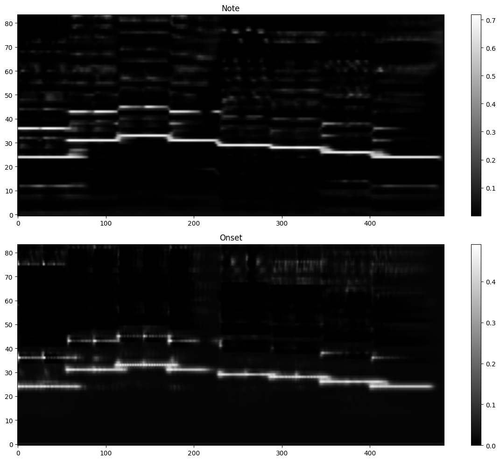
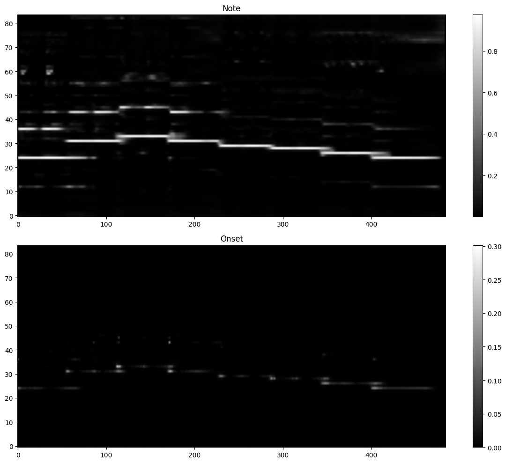
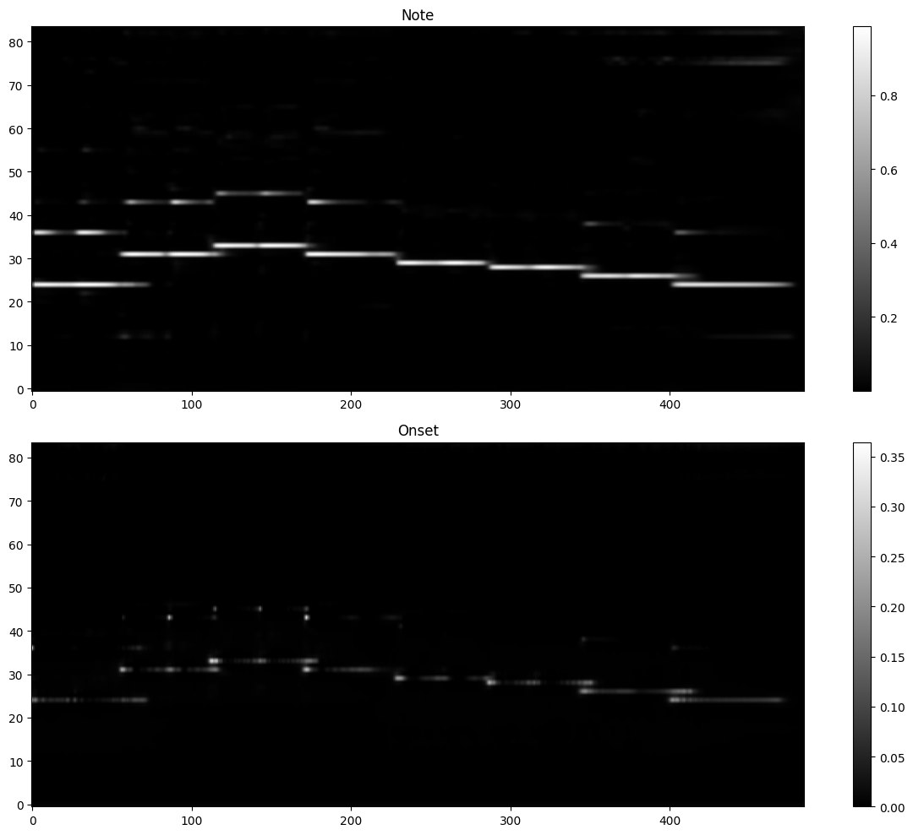
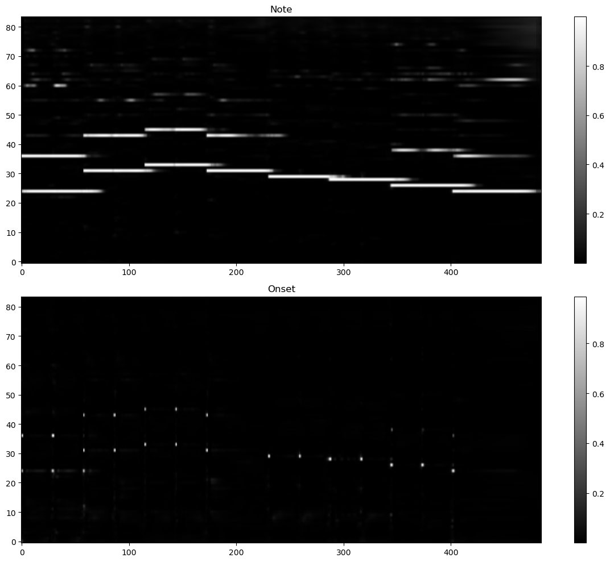
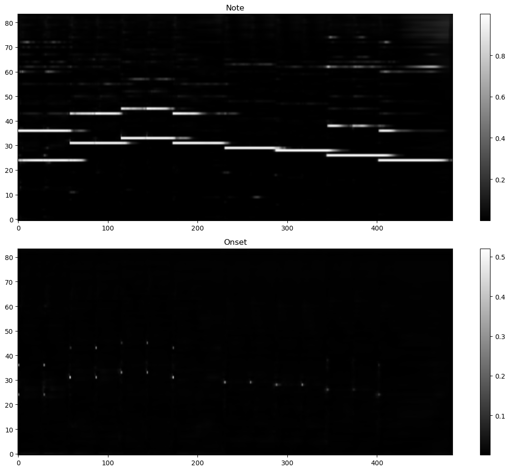
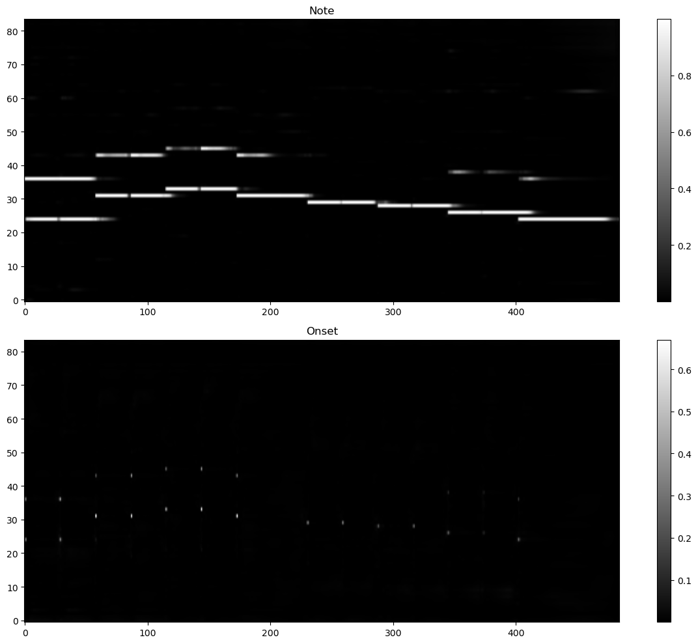
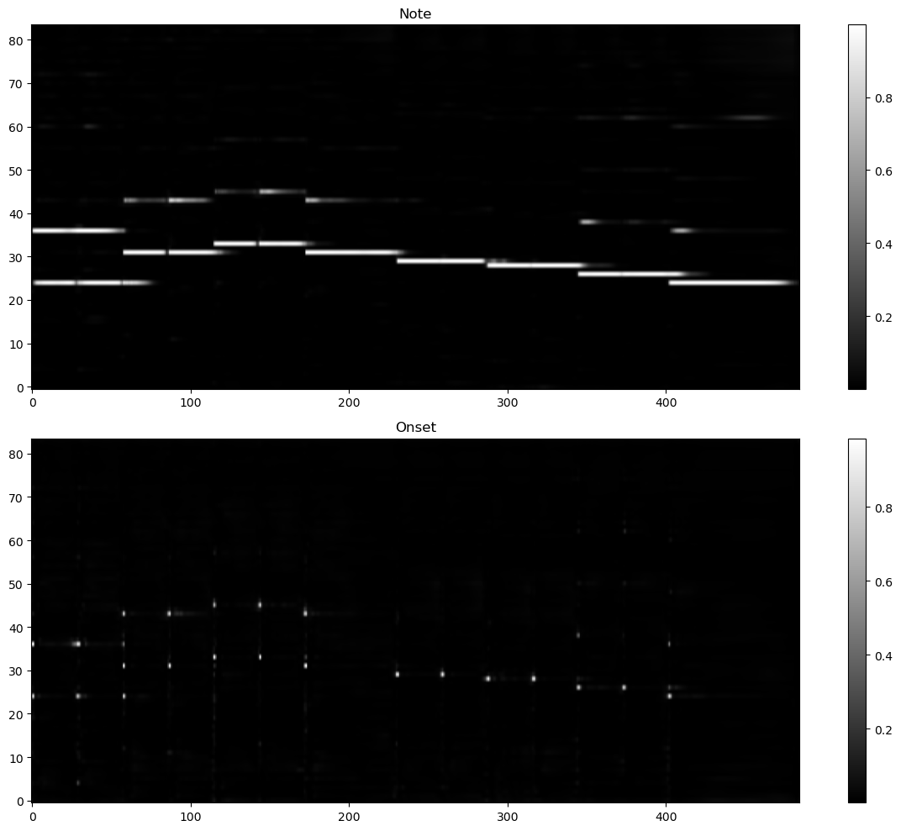

# BasicAMT: 音色无关转录
“音色无关”指模型对各种音色都有一定的泛化性，并不针对某个音色。输出会将所有声部放到一个音轨中。

## 结构
对标的是[BasicPitch](https://github.com/spotify/basic-pitch)，借鉴了其大部分结构，就某些地方进行了修改。

具体不同的地方如下：

### EnergyNorm
针对非负数据（能量）进行的归一化操作，加在CQT之后。参考了BasicPitch取了对数，发现能提升效果。BasicPitch的流程：log -> 强行归一 -> BatchNorm；我的方法：能量归一 -> log -> 可学习仿射变换。区别在于推理时BatchNorm的均值和方差是统计得到的，而我的是基于帕塞瓦尔定律每次算的，实验证明我的方法有不错的迁移性。此外，和直接整个时频平面进行Layernorm相比，泛化性更好且计算量更小，适合部署。

### dilation convolution
原文中使用了一个频域跨度39的大卷积核，我认为有如下问题：
1. 浪费参数：大部分情况下每个音只需要关注中间的bin（一个音符分析了三个bin），且并不是八度内所有音都会干扰频谱（只有+4、+5、+7、+12个半音的音才会有明显的谐波重叠）。
2. 关注范围还不够：文中没提padding的事（虽然有代码但我没看），如果两边padding那么只能分析上下八度的一半，如果高频padding只能分析到低八度，如果低频padding只能分析到高八度，无论怎么样padding范围都是不够的。

于是我使用了“空洞卷积”。首先对于39*3的大核，我用如下层替换，使之覆盖了上下两个八度且减少了参数量：
```py
CBR(16, 8, kernel_size=(25, 3), dilation=(3, 1), padding="same", stride=1)
```

此外还设计了专门针对谐波的空洞卷积组，但是消融实验发现没有用，于是删去，仅保留了跨越两个八度的大空洞卷积。

一开始使用cat进行跨层处理，然而发现用残差连接在效果不变的情况下，还减少了参数量。

### 损失
两个损失（frame和onset）都使用了focal loss；BasicPitch的frame用的是BCE，只有onset用了加权的BCE。
设计之初，受VAE训练的影响，在focal loss之外，我还加上了加权的MSE，但是收敛缓慢，效果不好，故删去。

关于focalloss的权重，发现少的正例的权重反而要低一些。为了找到合适的权重做了如下两个实验，每个实验内的对照组都在相同数据集上（随机生成的钢琴音色数据集）训练相同轮数、并比较了在同一乐器上的表现。模型都接收CQT频谱为输入，对照组间仅仅改变了两个focal loss的权重。测试使用的音频是[小星星](../data/inferMusic/piano_short.mid)，前七个音符（1155665）有八度和音。

1. 训练较少轮数时：

| note=0.80, onset=0.95 | note=0.80, onset=0.10 | note=0.25, onset=0.10 |
|-----------------------|-----------------------|-----------------------|
|  |  |  |

2. 模型完全收敛时：

| note=0.80, onset=0.94 | note=0.80, onset=0.06 | note=0.20, onset=0.06 | note=0.20, onset=0.94 |
|-----------------------|-----------------------|-----------------------|-----------------------|
|  |  |  |  |

观察尚未收敛的结果可以看到，onset正例权值越大，onset和note越接近，失去了onset的含义；note正例权值越大，音符的结尾就越模糊，不够精准，且有虚影。而收敛后，肉眼来看onset区别不大，但正例权值大的note拖尾长、虚影更多。这和focal loss原论文的结论是一样的：正例少，权重也要小。

最终，损失函数选择如下：
```py
note_loss = focal_loss(note_ref + onset_ref, note, gamma=1, alpha=0.2)
onset_loss = focal_loss(onset_ref, onset, gamma=1, alpha=0.06)
loss = note_loss + onset_loss
```

### 将CQT纳入参数
具体过程见下文“训练”一章，本处主要说结构。CQT使用了基于降采样的算法，八个八度共用参数以保持“轻量”。有研究说时频变换并非最优特征表示方法（比如Tasnet这种autoencoder），我也不认为目前的窗形状最合理（看到有论文说高斯窗最好，但我懒得调参用的是blackmanharris窗），所以应该让模型在理论的基础上微调。我认为利用CQT参数是进一步轻量化模型的关键。

此外将其加入模型也免去了后续在网页部署的时候用js实现CQT，端到端才是最快的。

**然而实验证明，CQT纳入训练只会在训练集上表现更好，泛化性有所损失。所以不应该将CQT纳入训练。**

## 训练
在 `RTX4090`上训练。训练分两阶段，用两类数据训练：
1. 使用[MusicNetEM](./train_basicamt_musicnet.ipynb)
2. 完全使用[随机合成数据](../data/septimbre/make_basicamt.ipynb)，并加入高斯噪声进行数据增强。

一开始尝试使用单曲多音色训练（单音色乐曲相加），但结果不佳。于是转为每次只输入一种音色，但是扩大了音色数目、单曲内音符更密集。

下面的训练过程针对“可学习CQT”：为了保证稳定性，分为两阶段训练，只有第二阶段才微调CQT参数。

### 第一阶段：学会一种乐器
以预计算的CQT为输入，使用了几种钢琴的音色，帮助模型快速学会利用频谱信息。训练代码见[train_basicamt.ipynb](train_basicamt.ipynb)。

使用的数据集生成配置为：

- piano_medium_short_256:（测试）
    ```
    instrument = [0, 1, 2, 3, 4, 5]
    midi_num = 30
    octave_weight = [1, 3, 5, 6, 5, 3, 1]
    frames = 360
    do_CQT = True
    ```
- piano_large_short_256:（训练）
    ```
    instrument = [0, 1, 2, 3, 4, 5]
    midi_num = 300
    octave_weight = [1, 3, 5, 6, 5, 3, 1]
    frames = 360
    do_CQT = True
    ```

### 第二阶段：学会更多乐器
在第一阶段的基础上，将CQT纳入训练参数中，以探索更好的时频表示方法。输入是单声道音频，见[train_basicamt2.ipynb](train_basicamt2.ipynb)。

在如下配置的数据集上训练：

- multi_large_256:（训练）
    ```
    instrument = [
        0, 1, 2, 6, 7,
        8, 10, 14,
        19, 21, 22,
        24, 25, 30, 38,
        40, 42, 44, 46, 48,
        53, 54,
        56, 60, 61,
        66, 68, 71,
        72, 77,
        81, 88, 98
    ]   # 33种乐器
    midi_num = 252
    octave_weight = [1, 3, 5, 6, 5, 3, 1]
    frames = 900
    do_CQT = False
    ```
- multi_medium_256:（测试）
    ```
    instrument = [
        0, 1, 2, 6, 7,
        8, 10, 14,
        19, 21,
        24, 25, 30,
        42, 44, 46, 48,
        53, 54,
        56, 60, 61,
        66, 68, 71,
        72, 77,
        81, 88, 98
    ]   # 30种乐器
    midi_num = 24
    octave_weight = [1, 3, 5, 6, 5, 3, 1]
    frames = 900
    do_CQT = False
    ```

最后导出为可以直接加载的模型：[model](best_basicamt_model.pth)，其使用方法见[use_model.ipynb](use_model.ipynb)，得到的ONNX为[basicamt_44100.onnx](basicamt_44100.onnx)。

~~将CQT纳入训练参数是一定有好处的。曾做过一个实验，第二阶段训练仍然使用第一阶段的数据集，发现损失还能再下降，说明CQT的参数选择确实有优化的空间。~~

上面仅仅用“损失”评价效果是不对的。实际上CQT会加剧对训练数据分布的过拟合，导致泛化性下降，在别的数据集上效果不行。在没有很大很丰富的训练数据时不建议使用可学习CQT。

## 音符创建（二值化）
这一步完全照搬BasicPitch，实现在[postprocess.py](../utils/postprocess.py)的output_to_notes_polyphonic函数。下面是对BasicPitch项目文件结构的浅析：

README中说可以命令行，经了解得知需要setuptools进行命令的注册。但是其`setup.py`中的setup函数没有任何参数。于是发现可以在`pyproject.toml`中规定：

```toml
[project.scripts]
basic-pitch = "basic_pitch.predict:main"
bp-download = "basic_pitch.data.download:main"
```

说明是`basic_pitch/predict.py`中的main函数。这个函数用argparse创建了命令。在这个文件中可以看到默认的参数，发现调用的是`basic_pitch/inference.py`的predict函数，而这个函数调的又是`basic_pitch/note_creation.py`的model_output_to_notes函数，而这个函数主要调用了output_to_notes_polyphonic函数。

基本思路是，首先从frame中根据强度突变推断出onset，和模型产生的onset合并；然后对每个onset分析其后面的frame并创建音符，音符结尾的判定是连续x帧低于阈值。由于分析frame时是顺着时间，所以分析onset的顺序是逆着时间，可以防止前后干扰。onset用完后，循环从剩下的frames中找最大值，并顺着逆着时间找阈值以上的连续帧，创建额外的音符。

onset的阈值和frame的阈值是两个超参数，经测试发现：frame阈值可以低一些，而onset的阈值一旦低就会把音符打断，所以应该高一点，说明其实大多数音符是不依赖onset而创建的。frame阈值的选择参考了eval时搜索到的阈值。


## 犯过的蠢
- 怎么训练都不好：后来发现没有清除梯度。起因是一开始用半精度加速，此时清空了梯度的。但是结果有nan，修改代码的时候误删了。那段时间对240帧的损失一直在2000以上，修改后变为400~500。
- 谐波重影严重：明明使用了“Harmonic Stacking”和“和弦卷积”，为什么仍然有八度误差？结果发现是Harmonic Stacking平移错方向了，修改后效果好了很多，loss又降。


## 导出为ONNX
basicamt的目标是在网页上用，故需要导出为ONNX。见[use_model.ipynb](use_model.ipynb)的后半部分。

torchaudio的filtfilt（在降采样CQT中用到）会导出失败，说是ONNX不支持。查看了源码(filtering.py)，发现如下代码：

```py
if _IS_TORCHAUDIO_EXT_AVAILABLE:
    _lfilter = torch.ops.torchaudio._lfilter
else:
    _lfilter = _lfilter_core
```

然而并没有找到`torch.ops.torchaudio._lfilter`的定义，只看到了上方`_lfilter_core`的定义。把这段代码注释掉，强制要求`_lfilter = _lfilter_core`，发现可以导出了！但是运行结果非常糟糕，完全不对！

官网说用`dynamo=True`更好，然而在进行如上操作后还是报错：`_lfilter_core_cpu_loop`不支持。发现源码：

```py
if _IS_TORCHAUDIO_EXT_AVAILABLE:
    _lfilter_core_cpu_loop = torch.ops.torchaudio._lfilter_core_loop
else:
    _lfilter_core_cpu_loop = _lfilter_core_generic_loop
```

于是一样注释了源码强制选择了能看到函数定义的`_lfilter_core_generic_loop`，但运行非常非常非常非常慢！而且导出失败。如果`dynamo=False`且使用`_lfilter_core_generic_loop`，好不容易导出成功，结果文件大小高达400M，根本跑不动。

经历的一切都说明torchaudio的filtfilt函数有问题。于是决定自己实现一个。刚好本来CQT中计划就是换iir为fir滤波器，而fir可以完全用conv1d实现。

filtfilt基本原理参考[《Matlab的filtfilt函数解析与C++实现》](https://blog.csdn.net/dracula000/article/details/128199492)，大意为把输入正过来滤波、再反过来滤波、最后再反过来返回，两次滤波参数共享。难点在于边缘效应的补偿，需要两遍延长补一段数据，还有一个`zi`参数，补偿的效果是滤波结果开头和结尾的两个采样点和输入一样。具体原理没心思去了解，照猫画虎完成了补数据的部分，而`zi`则直接调用`scipy.signal`的函数`lfilter_zi`（阅读sicpy的filtfilt找到的）。

单次滤波本来使用10阶的iir，经过测试发现33阶fir可以达到差不多窄的过渡带。接下来是测试效果，见[testfiltfilt.ipynb](../model/testfiltfilt.ipynb)。我震惊地发现开头结尾都没和torchaudio的filtfilt吻合，而且差别较大。我猜测可能torchaudio根本没用边缘补偿？于是写了一个两边补零、不补偿的filtfilt，然而还是相差甚远，但效果竟然也可以？看来没有必要让输入和输出的两端一样。接着我绘制了频域的幅度和相位谱，发现torchaudio的filtfilt效果非常差！不仅通带内幅度变化较大，阻带抑制也不够。要知道10阶iir的阻带抑制比33阶fir大很多！

于是非常愉快地改用了自己的filtfilt，见[CQTsmall_fir](../model/CQT.py)，再次导出ONNX，一路顺风！

运行ONNX时报错：`Non-zero status code returned while running Conv node. Name:'/early_conv/early_conv.1/act/Relu_output_0_nchwc' Status Message: Dilation not supported for AutoPadType::SAME_UPPER or AutoPadType::SAME_LOWER`，是dilation不支持用“same”指定padding，得明确。

最后得到的是[basicamt_44100.onnx](basicamt_44100.onnx)，输入为44100Hz、shape为(1,1,time)的"audio"，输出为(1,84,frames)的"onset"和(1,84,frames)的"frame"。