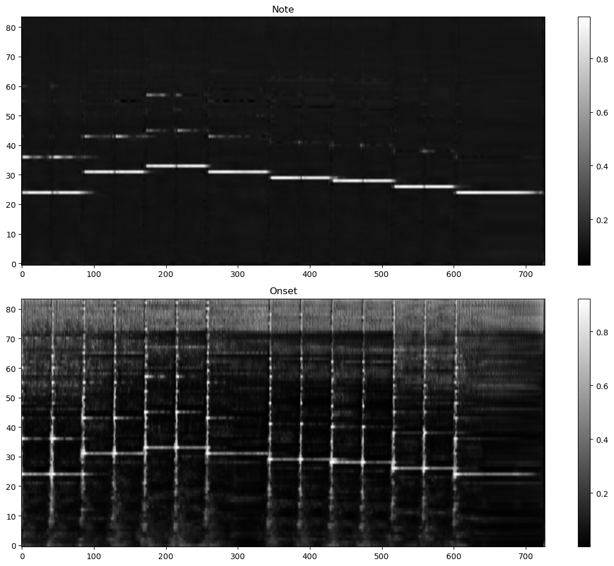

# "音色无关转录"Baseline——BasicPitch
为了评估模型，需要横向对比。自然是选择同一个赛道的BasicPitch了：https://github.com/spotify/basic-pitch

## 模型搭建（异同）
平台是windows，但最新的win-tensorflow无法使用gpu，2.10的可以，但项目要求使用python>=3.11，而tensorflow2.10只能在更低的python版本中用，因此无法跑源代码，只能在torch上复现。

结构上，我没有contour只有note和onset，而basicpitch论文里说去掉contour效果基本不变，于是我就遵循了源码上无contour的结构。如果用了contour，会先降维到1再拓展到32，损失了大量信息，我认为这会显著降低后续的性能，况且也没有contour的标注，所以删去这个降维的步骤是非常合理的。不过去了一层导致模型参数变多了。

损失函数照搬源码。我用的是focalloss且负样本权值大；basicpitch的note用BCE，onset用正样本权值大的weighted-BCE。

basicpitch没有将CQT纳入训练参数中，为了比较公平我用了我的CQT，不参与训练。CQT后的处理照搬源码，即先取log再平移缩放到0~1，最后batchnorm。我之前也尝试过用对数幅度谱，但由于我的训练过程中加入了噪声以增强数据，而log对噪声非常敏感，于是作罢，而训练basicpitch时也无法加入噪声。我用的是类似RMSNorm的归一化方法，因为没取log而能量非负。

原论文CQT用的是hann窗，我的是blackmanharris；发现源码也是用卷积层实现抗混叠，但我的抗混叠是零相位的，而且滤了两次衰减肯定更好。综合来说应该都优于源码。

数据方面直接使用了basicamt第二阶段的训练数据，由于要用benchmark加速，所以batchsize沿用了我的18（论文中说用16，差不多）。为了加速训练给这个数据集补上了CQT，见[calc_cqt.ipynb](calc_cqt.ipynb)。训练硬件都是4070。

## 评估与比较

### 主观感受
去掉CQT参数，我的参数量比它的少，按理来说性能是会降低的，所以如果我打得过它起码说明CQT纳入参数非常有意义。

后面的评估仅仅关注了note，因为onset实在没必要比——basicpitch的加权策略和我完全互补，导致收敛时onset训练仍然非常不到位：

但我的loss也有自己的问题：阈值明显低于basicpitch。也许用了后处理后其实效果差不多呢？况且onset在我看来最大的用途就是断开连续的音，因此就不测评了。最重要的还是帧级指标。

