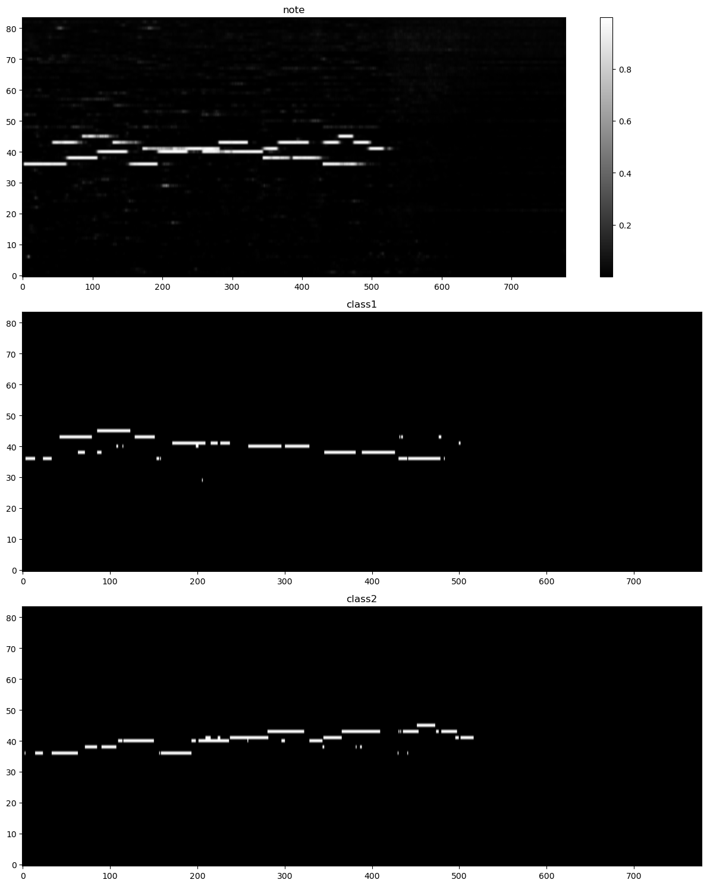
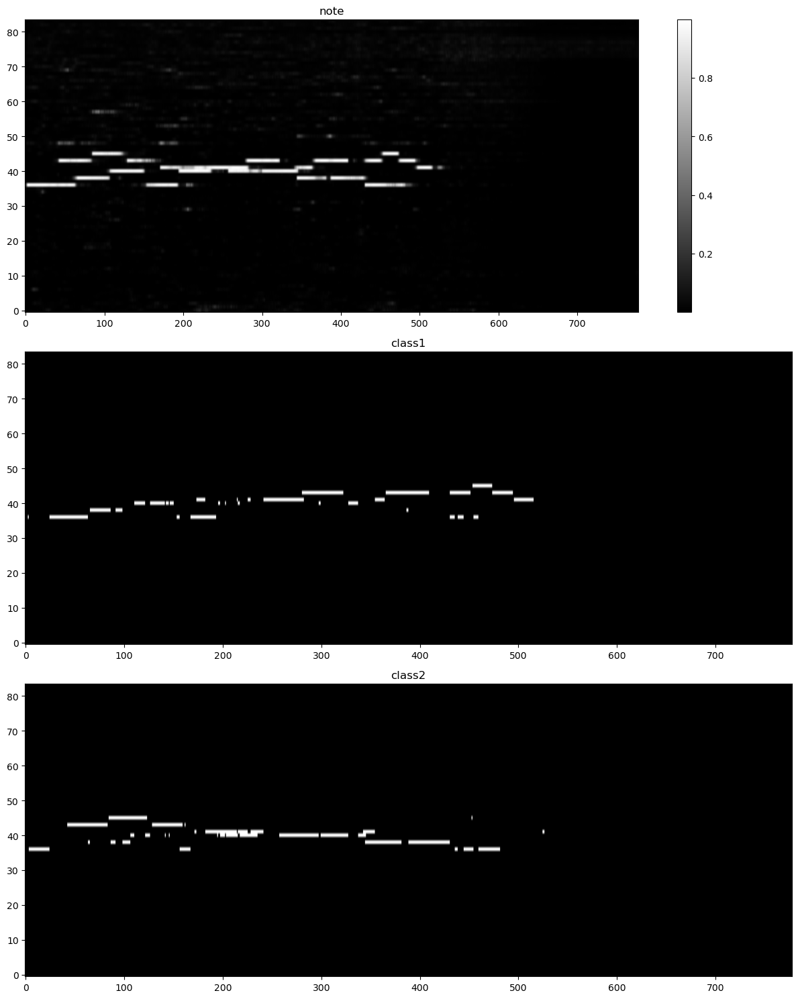

# 音色分离转录

之前的想法是先获取一个音色的冲激响应，然后用匹配滤波得到音符，接着用冲激卷积音符得到一个音色的频谱，最后用分离的频谱和原频谱做差得到下一个迭代的输入频谱。然而有如下问题：
1. 如何获取一个音色的冲激响应？之前尝试对平均值用全局的注意力，但是效果未知。
2. 匹配滤波要求不同音色的特征向量相互正交，但是很难做到。
3. 即使成功分离出一个音色的频谱，也不能直接相减，因为网络中必定要进行归一化。所以此时相当于从单通道的盲源分离变为双通道的盲源分离，并没有简化太多，下一个迭代很难进行。有的文章中直接把两者输入下一个迭代，用网络完成双通道的盲源分离，但是这样更难训练了。

综合来看，最合适的还是聚类、一次性分离，或者每次分离直接得到“target”和“rest”。结合之前的思路，可以用聚类得到一个音色的冲激响应，后面完全用无参线性的网络，一次分离出“target”和“rest”。

## 深度聚类

分离领域深度聚类的一般思路是，将每个“时间-频率单元”编码为高维特征向量$ \vec{v}_{f,t} \in R^D $，其中$D$是特征维度，$f \in [0,F)$是频域编号，$t \in [0, T)$是帧数，则时频单元有$N=FT$个，一般而言$N \gg D$。然后用机器学习的聚类算法完成分类；“分类”实际上是对时频谱使用了二值的mask。

由于“聚类”的存在，因此分离不是端到端的，训练目标也是聚类算法的目标。一开始使用了Kmeans的目标：使用欧氏距离度量差距，最大化类间差距、最小化类内差距，用LDA中的除法将两者关联起来。然而实际效果并不好。于是了解到“维度诅咒”，发现欧氏距离在高维空间并不好用，于是转向余弦相似度，借用了论文《Deep clustering: Discriminative embeddings for segmentation and separation》的公式：
$$
\begin{aligned}
L &= {\parallel VV^T-YY^T \parallel}_F^2 \\
&= {\parallel V^TV\parallel}_F^2 - 2{\parallel V^TY\parallel}_F^2 + {\parallel Y^TY\parallel}_F^2
\end{aligned}
$$
第一行用的是$N \times N$的矩阵的MSE，而第二行将其化简成了$D \times D$的矩阵，极大减少了计算量。证明如下：
$$
{\parallel A \parallel}_F^2 = \sqrt{\sum_i^m\sum_j^n|a_{ij}|^2} = \sqrt{trace(A*A)} \\
trace(AB)=trace(BA) \\
{\parallel V^TV\parallel}_F^2 = trace((V^TVV^T)V) = trace(V(V^TVV^T)) = {\parallel VV^T\parallel}_F^2
$$

由于Y是onehot编码，因此$YY^T$的每个元素是0（正交）或1（同向）；然而正交的要求太高了，反向（-1）其实更好区分，所以我还是使用了最初的MSE公式，对相似度为负数的放宽了要求：
$$
L = {\parallel LeakyReLU(VV^T)-YY^T \parallel}_F^2
$$
LeakyReLU的负半轴的斜率设置了0.3。可能设置成0会更好。计算性能虽然下降了但没太大影响。

但是上式假设已经几乎分类成功，即同类的相关度大于0。如果从头开始，应该忽略不同类且相似度为负数的。但奇怪的是实验表明使用LeakyReLU效果更好（主观感受）。

使用余弦相似度时，每个时频特征向量的含义非常像Hinton的Capsule：方向表示含义，幅度表示程度；这里方向表示音色，幅度表示力度。所以最理想的情况是，时频编码的幅度就是音符出现的后验概率，用余弦相似度能对其分类。然而当我尝试用最终编码的幅度作为AMT结果时，发现AMTloss不收敛。

## 记忆
三月初的想法：希望模型能像人一样，对各个音色留有一点印象。于是想到了Hopfield网络。Hopfield网络通过建模输入节点之间的关系，实现了一定的联想记忆。其训练使用的是Hebb学习法，简而言之，对每一个输入（列）向量$ \vec{x_i} $，统计节点关系：
$$ X = \frac{1}{N} \sum^{N}_{i=1} \vec{x_i} \times \vec{x_i}^T $$
在Hopfield网络中，$ \vec{x_i} $的每一个元素$ x_{ij} \in \{-1, +1\}$，且没有自相关，即$X$的对角线要置零。推理时，输入一个模糊记忆$ \vec{y} $，用下式得到记忆中的匹配项：
$$ \hat{x} = \vec{y} \cdot X $$
再把小于零的变为$-1$、大于零的变为$+1$，迭代多次即可恢复记忆。在此语境下，Hebb学习规则让需要记忆的数据的“网络能量”最低（记忆点即能量低谷），推理时的迭代其实在用梯度下降使得输入的网络能量逐步降低，最终到达记忆点。

不如在训练神经网络的同时训练一个Hopfield网络？让网络先过一遍所有音色，形成记忆点；然后对每个时频单元，从记忆中查询最相似的音色，这样就能把相似的时频单元向记忆点聚集，让聚类的簇更紧密。

由于二值性，Hopfield网络能完美联想出记忆（不考虑记混的情况）；但是也由于二值性，局限性非常大；但其思想——特别是Hebb学习规则，值得借鉴。一个方法是对原来的音色特征向量通过Tanh二值化到${-1, +1}$，照搬Hopfield，但是二值化会导致空间容量大大降低；第二个方法是对连续值用Hebb学习规则。

对于第二个方法进行了尝试。经过一些网络后，得到了一个时频编码矩阵：$V \in R^{D \times F \times T}$，其中D是特征维度、F是频点数、T是帧数。首先reshape为$\widetilde{V} \in R^{FT \times D}$，然后进行Hebb学习：
$$
X \in R^{D \times D} = \frac{\widetilde{V}^T \widetilde{V}}{TF} 
$$
上式相当于对每个时频单元一视同仁，然而音符相对于时频谱是稀疏的，并不是每个时频点都重要，因此必须要加权。重要的时频单元其实就是音符，即“音色无关转录”的结果。假设已经获取了“音色无关转录”结果$ M \in R^{F \times T} $，其中每个元素是音符存在的后验概率$ m_{f,t} \in (0, 1) $，可以用于加权。将M reshape为$\widetilde{M} \in R^{FT \times 1} $，于是公式变为：
$$
U \in R^{FT \times D} = \widetilde{V} \odot \widetilde{M} \\

X \in R^{D \times D} = \frac{U^T U}{\pmb{\vec{1}}^T \cdot M \cdot \pmb{\vec{1}} }
$$
就是用M对V进行加权（幅度缩放）得到U，归一化分子使用的是M的元素和。

再对每个时频点进行联想：
$$
\hat{\widetilde{V}} \in R^{FT \times D} = \widetilde{V} \cdot X
$$
理论上要重复多次，但是《Hopfield Networks is All You Need》指出一次就可以极大逼近（虽然是他们新的Hopfield网络）。整个公式如下所示：
$$
\hat{\widetilde{V}} = \frac{\widetilde{V} U^T U}{\pmb{\vec{1}}^T \cdot M \cdot \pmb{\vec{1}} }
$$
我突然发现，这不就是没有softmax的注意力吗！而且通过先计算后面的$U^TU$极大降低了计算的复杂度。

我尝试了将Hebb应用于网络。由于要用到“音色无关转录”，网络基本类同[basicamt](../basicamt/README.md)，但由于音色和相位密切相关于是HS时加上了相位信息。原网络的结构中，先进行时频编码，再在此基础上得到note和onset，近似于一个主干两个分支。因此我尝试加入了“聚类”分支，使用Hebb对主干的输出进行“回忆”，再求聚类损失。然而，如果多次使用Hebb学习会导致最后全部分为一类。我怀疑是因为对角线需要像Hopfield一样置零，但效果更差。

Hebb学习和注意力机制的区别在于softmax，softmax实际上导致了“胜者通吃”，失去了softmax会导致“平凡注意力”。于是我从“注意力”的方向继续探索。由于时频点数FT远大于编码维度D，因此不可能用原始的Attention（复杂度太高）。首先尝试了Linear Attention，即先对Q和K用核函数，再按Hebb方法求注意力。然而效果并不好。进一步了解到了清华的FlowAttention，用竞争机制实现了一定的聚焦，终于有所收获，训练结果如下图所示

FlowAttention之前QKV完全相同，而参考了Transformer后，用三个卷积作用与主干的输出得到三个不一样的值作为QKV，且结果加上了残差连接。为了增强mask的作用，在KV输入网络前将幅度强制缩放为mask（而不是仅仅相乘）；此外发现对mask做全局归一化效果更好（即mask/mask.sum()）。我猜测因为FlowAttention中使用了sigmoid作为核函数，小幅度使得梯度较大。此外，我想如果音频变长，会导致归一化后mask的均值变小，如果在标准attention中这会导致softmax趋同，是否可以理解为“注意力更广”？

既然需要使用“更广的注意力”，我猜测用Linear Attention可能效果也会好，因为之前尝试LA时QKV没有投影。相关结果存放于文件夹v2。实验时发现无需mask归一也能收敛，损失值与FlowAttention相当，但在用于观察效果的音频上却表现不佳，如下图所示

## 多目标训练Loss均衡
有两个训练目标：AMT损失（focal loss）和聚类损失（相似度矩阵的MSE）。大部分时间内，前者量级远小于后者，前者学习速度也远快于后者。

首先需要平衡量级，通过加权得到。然而写死的加权疑似无法适应不同的学习速度，因此需要考虑动态加权。我的思路是缩放到较小一方的量级，因为AMT训练超参数已经在basicamt中探索出了可行的配置。
$$
\begin{aligned}
L_{Cluster} \times \alpha &= L_{AMT} \times (1-\alpha) \\
\alpha &= \frac{L_{AMT}}{L_{Cluster} + L_{AMT}}
\end{aligned}
$$
类似于电阻并联，较小的将起主导作用。从此视角可以拓展到多个损失，效果是加权后值一样：
$$
\alpha_i L_i = \frac{1}{\sum_{j=1}^{N}\frac{1}{L_j}}, \forall i \in [1, N]
$$

其次需要有一定“动量”以适应波动，即加一个低通IIR。我选择直接加在$\alpha$上，因为简单。

上述算法相当于进行了归一化，并未对训练速度均衡。所以引入了DWA，基本原理如下：
$$
\begin{aligned}
\vec{r}(t) &= \frac{\vec{L}(t-1)}{\vec{L}(t-2)} \\
\vec{w}(t) &= softmax(\vec{r}(t) / T)
\end{aligned}
$$
其中$\vec{r}(t)$利用前两次损失值计算而得，意为“训练速度的倒数”，$\vec{w}(t)$是本次的损失加权，可见下降速度越慢的损失权值越大。T控制了softmax后的平滑程度。

注意，使用DWA必须平衡量级。虽然量级不会影响DWA权值分配，但是本来的量级差异将抹去DWA的分配效果。

在我的建模中两者应该是相辅相成的，然而实际结果中，疑似相互拉扯：虽然在训练集上两者都在降低，但是验证集常常有此起彼伏的现象。于是我试图引入PcGrad——一种针对梯度冲突的梯度更新策略。然而引入PcGrad导致训练非常慢（无论是每个epoch的计算时间还是收敛速度），删了之后发现有量级归一化和DWA已经足够，在适当加大AdamW的学习率后学习迅速，训练同一个模型，相比固定权值能学到更小的AMTloss，且验证集上Clusterloss相当，而且训练集和验证集的损失差距减小了，说明泛化性变强了。

## 替代聚类
聚类有三个缺点：
1. 慢，特别是本任务中数据量很大。
2. 非黑即白的分类。对于一个时频点，只能分给一个类，但没考虑现实情况中“两个乐器演奏同一个音”的情况。
3. 对于大部分聚类算法，需要明确类别数，而这往往是难以提前得知的。

有以下几种后处理解决方法：
1. 迭代分离。根据训练目标，假设不同音色之间基本正交，假设余弦相似度在

## 历史
### 现在的
最终模型是在V1上增加了onset相关层、且仅仅训练了onset部分得到，并非三个任务（cluster、note、onset）一起训练而得，因为加上了onset相关层后从头开始训练，实验了两次都不如V1。

有两个模型文件：`cluster_model_0.pth`即为在V1基础上训练onset得到，而`cluster_model_1.pth`在0的基础上整体继续训练了一轮。0的整体效果都比1好，但1在三分类的表现比0好。

所有模型训练都使用了同一套数据，配置见[make_sep](../data/septimbre/make_sep.ipynb)，仅仅只有约12分半的数据，但是通过两两组合实现了超多的数据量。仅仅在二分类上训练，在三分类上有一定的泛化性，但效果大打折扣。

### v1
最成功的一个。是第一次使用FlowAttention，大获成功。
- 开头和结尾的Projection
    去掉了源代码中开头的Projection，为了保持一致在外部用卷积代替，结果发现效果非常好！之前不行的都没有开头和结尾的Projection，此后也尝试过去掉，效果都很差，说明Projection在Attention中有重要作用。
- 残差连接
    实验表明没有残差会导致不收敛。
- 没有FFN
    实验表明加上了FFN没什么用，还难以训练了。
- 用note对KV加权
    即让转录结果干预聚类，加上后确实比没有好。此外实现V1时疑似因为没有改Hebb的代码导致masknorm时对note进行了求和归一化处理，后续的实验表明这个操作非常关键，能极大加速和稳定训练。原因猜测在上面提过。

### v2
在v1对“mask求和归一化”猜测的基础上，用LA替换了FA，同时使用了忽略负值的损失，可分类效果就是不如使用了FA的。不过能收敛